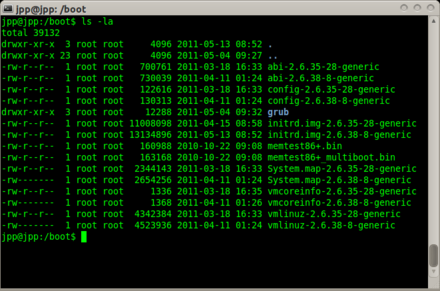
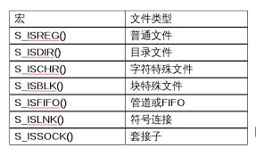

前面我们介绍了文件的创建，打开，读写，关闭。这一小节主要跟大家介绍一下文件的属性和权限。如果大家读过鸟哥的话肯定对ls命令很熟悉了。我们在我们的终端（ctrl+alt+t）上键入ls -l之后，会产生什么效果？我们先介绍具体的系统调用，后面呢，我们会具体一个例子来体现这些系统调用的使用。



效果就像上图一样。我们可以看到的所有的数据，都是文件的属性的一部分。比如：前面看到文件的权限，所属用户，所属组等等。在这一小节都会跟大家做一个说明。OK,现在就进入文件属性和权限的学习吧。

我们可以使用stat/fstat/lstat函数来获取文件的属性。

##系统调用——stat/fstat/lstat

```
#include<sys/types.h>
#include<sys/stat.h>
#include<unistd.h>

int stat(const char *filename, struct stat *buf);
int fstat(int fd, struct stat *buf);
int lstat(const char *file_name, struct stat *buf);

这三个函数成功都返回0，失败返回-1;
```
这三个系统调用的第一个参数都是确定是哪个文件的，fstat是文件描述符（需要用open打开），其他两个是文件路径。那lstat和stat的区别是什么？答案很简单，如果文件是符号链接时，lstat返回的是符号链接本身的信息，而stat返回的是符号链接所指向的文件的信息。
第二个参数是将文件的信息保存在的结构体。当然，我们第二个参数需要好好聊聊。

我们可以在man手册上查看到stat结构体的结构：

```
struct stat {
    dev_t     st_dev;     /* 文件的设备编号 */
    ino_t     st_ino;     /* inode号 */
    mode_t    st_mode;    /* 文件的类型和存取的权限 */
    nlink_t   st_nlink;   /* 连到该文件的硬连接数目，初始为1 */
    uid_t     st_uid;     /* 用户ID */
    gid_t     st_gid;     /* 组ID */
    dev_t     st_rdev;    /* (设备类型)若此文件为设备文件，则为其设备编号 */
    off_t     st_size;    /* 文件大小（单位字节） */
    blksize_t st_blksize; /* 文件系统的块（I/O缓冲）大小*/
    blkcnt_t  st_blocks;  /* 块数 */
    time_t    st_atime;   /* 最后一次访问时间 */
    time_t    st_mtime;   /* 最后一次修改时间 */
    time_t    st_ctime;   /* 最后一次改变时间(指属性) */
};
```
从给出的解释已经不难看出它们的作用了。但下面我还要讲一下几个经常用到或者说是比较重要的字段。

###st_mode字段：下图是st_mode位掩码的布局。


图中User,Group,Other分别代表这三个不同身份的人对此文件使用权限。w（写），r（读），x（执行）。在代码中，我们可以将st_mode和S_IFMT相与（&），就可以从中获取文件类型。例如：

```
if((statbuf.st_mode & S_IFMT) == S_IFREG)
    printf("regular file\n");
```

现在我们还可以利用标准宏将其简化：

```
if(S_IDREG(statbuf_.st_mode))
    printf("regular file\n");
```
下图是常用来检查文件类型的宏：



ps：除去如图的"()"符号，就可以用第一种方式来判断文件属性了。


###各种time（文件时间戳）

关于时间的三个字段，是自Epoch以来的所有秒数。也就是说，要想显示我们清楚的时间格式我们必须要进行转换。例如：
```
asctime(gmtime(&Time))；

```

##系统调用——utime/utimes
前面我们看到，文件属性里面有事件戳这个信息，每次当我们修改该文件时候，就需要修改时间戳。
```
#include<utime.h>

int utime(const char *pathname, const struct utimbuf *times);

成功时返回0，失败返回-1并设置errno位。

#include<sys/time.h>

int utimes(const char *pathname, const struct timeval tv[2]);

成功时返回0，失败返回-1,并设置errno位。
```

两个函数第一个参数都表示文件，不同点在于第二个参数，utimes可设置的精度达到微秒级。我们首先看一下utimbuf的结构：

```
struct utimbuf {
               time_t actime;       /* 访问时间 */
               time_t modtime;      /* 修改时间 */
           };
```
接下来是timeval的结构：
```
  struct timeval {
               long tv_sec;        /* 秒 */
               long tv_usec;       /* 微秒 */
           };
```
utime的运作方式有两种：

1.  如果第二个参数为NULL，则将文件的访问时间设置为当前时间。当前进程要模具有特权级权限，要么其有效用户ID和文件的用户ID相匹配，并且对文件有写权限。
2.  若将第二个参数指向一个utimbuf的结构体，便会用指向的结构来更新文件的时间戳。此时的进程要么具有特权级权限，要么进程的有效用户ID必须匹配文件的用户ID。

utimes系统调用：

新的文件访问时间在tv[0]中指定，新的文件修改时间在tv[1]中指定。


上面我们可以通过lstat系统调用来获取文件的详细信息。那我们可不可以更改这些属性呢？或者说，如果我们自己开发软件之后，也需要对文件最后访问时间进行修改，那这个需求应该怎么实现呢？

##系统调用——chmod

在终端下，我们可以使用一些命令来改我们文件的属性，就好比chmod（更改文件权限）。同样，我们也可以在程序中对文件属性进行修改。
```
#include<sys/stat.h>

int chmod(const char *path, mode_t mode);

成功返回0，失败返回-1并设置errno位。如果返回-1，则不更改文件属性。

```

第一个参数是文件的路径，mode参数用来更改参数path所指定文件的权限。

常见的参数：

权限宏 | 权限码 | 含义
----|------|----
S_ISUID | 04000  | (set user-id on execution)位
S_ISGID | 02000  | (set group-id on execution)位
S_ISVTX | 01000  | 文件的sticky 位
S_IRUSR (S_IREAD)  | 00400 | 文件所有者具可读取权限
S_IWUSR (S_IWRITE) | 00200 | 文件所有者具可写入权限
S_IXUSR (S_IEXEC)  | 00100 | 文件所有者具可执行权限
S_IRGRP | 00040 | 用户组具可读取权限
S_IWGRP | 00020 | 用户组具可写入权限
S_IXGRP | 00010 | 用户组具可执行权限
S_IROTH | 00004 | 其他用户具可读取权限 
S_IWOTH | 00002 | 其他用户具可写入权限
S_IXOTH | 00001 | 其他用户具可执行权限
  

errno会遇到的错误代码：

1. EPERM 进程的有效用户识别码与欲修改权限的文件拥有者不同, 而且也不具root 权限.
2. EACCESS 参数path 所指定的文件无法存取.
3. EROFS 欲写入权限的文件存在于只读文件系统内.
4. EFAULT 参数path 指针超出可存取内存空间.
5. EINVAL 参数mode 不正确
6. ENAMETOOLONG 参数path 太长
7. ENOENT 指定的文件不存在
8. ENOTDIR 参数path 路径并非一目录
9. ENOMEM 核心内存不足
10. ELOOP 参数path 有过多符号连接问题.
11. EIO I/O 存取错误


我们用一个例子来研究一下它的用法。

```
#include<sys/types.h>
#include<sys/stat.h>
#include<stdio.h>
#include<stdlib.h>
#include<errno.h>
#include<unistd.h>

int main(int argc , char * argv[])  {
    /*我们可以在当前目录下使用"touch 1.text"命令创建一个文件
     *使用"ls -l 1.text"命令查看文件的属性
     *我们首先在程序中打印出文件的属性
     *我们使用chmod系统调用来更改文件的属性
     *打印更改之后的文件属性
     */
    struct stat buffer;
    if(stat("1.text", &buffer) == -1) {
        fprintf(stderr, "stat:");
        exit(1);
    }
    printf("Before change, file mode is %o\n",buffer.st_mode);

    //更改文件属性
    if(chmod("1.text", S_IRUSR | S_IWUSR | S_IXUSR) == -1) {
        fprintf(stderr, "chmod:");
        exit(0);
    }
    if(stat("1.text", &buffer) == -1) {
        fprintf(stderr, "stat:");
        exit(1);
    }
    printf("After change, file mode is %o\n",buffer.st_mode);
    return EXIT_SUCCESS;
}

```
我们刚touch创建的文件的权限是0666，但我们使用chmod系统调用之后，文件的权限变成了0700。


##系统调用——chown/fchown/lchown

这三个系统调用可以更改文件的所有者或组。

```
#include<sys/types.h>
#include<unistd.h>

int chown(const char *path, uid_t owner, gid_t group);
int fchown(int fd, uid_t owner, gid_t group);
int lchown(const char *path, uid_t owner, gid_t group);

成功返回0，失败返回-1，并设置error的值。
```
这些系统调用更改一个文件的所有者和组（分别是第二跟第三个参数），区别在于如何指定文件。chown改变由path制定的文件，如果path是符号链接，则指向链接到的文件。fchmod改变由已打开的文件描述符fd所引用的文件。lchmod类似chmod，区别在于第一个参数如果是符号链接，则更改该链接的组和属性。

Talk is cheap, shouw me the code.

```
#include<sys/types.h>
#include<sys/stat.h>
#include<stdio.h>
#include<stdlib.h>
#include<unistd.h>

int main(int argc , char * argv[])  {
    /*我们可以在当前目录下使用"touch 1.text"命令创建一个文件
     *使用"ls -l 1.text"命令查看文件所属的用户和组
     *我们首先在程序中打印出文件所属的用户和组
     *我们使用chmod系统调用来更改文件所属的用户和组
     *打印更改之后的文件所属的用户和组
     */

    struct stat st;
    if(stat("1.text", &st) == -1) {
        fprintf(stderr, "stat:");
        exit(0);
    }
    printf("Before change, file owner is %d\t file group is %d\n",st.st_uid, st.st_gid);
    
    //更改文件所属用户和所属用户组
    if(chown("1.text", 0, 0) == -1) {
        fprintf(stderr, "chown :");
        exit(0);
    }
    if(stat("1.text", &st) == -1) {
        fprintf(stderr, "stat:");
        exit(0);
    }
    printf("After change, file owner is %d\t file group is %d\n",st.st_uid, st.st_gid);
    return EXIT_SUCCESS;
}

```
因为我要将文件改为root用户和root组，因此运行时候需要加sudo权限.或者使用root用户执行。此时，我们可以在终端下ll查看“1.text”文件的所属者和所属的用户组变成了root。


##系统调用——umask

umask系统调用会改变文件的掩码。其实我们使用open函数创建文件时候，参数mode并不是 建立文件的权限，而是（mode&～umask）的权限值。例如： （0666 & ~022 = 0644; i.e., rw-r--r--）所以有时候我们可是使用umask屏蔽文件的某权限。

```
#include <sys/types.h>
#include <sys/stat.h>

mode_t umask(mode_t mask);

此函数调用总是会成功，返回原先的值。
```
参数mask是几个常用宏。

mask的使用例子：

```
#include<sys/types.h>
#include<sys/stat.h>
#include<limits.h>
#include<stdio.h>
#include<stdlib.h>
#include<errno.h>
#include<string.h>
#include<signal.h>
#include<netinet/in.h>
#include<arpa/inet.h>
#include<unistd.h>

#define RWRWRW (S_IRUSR | S_IWUSR | S_IRGRP | S_IWGRP | S_IROTH | S_IWOTH)

int main(int argc , char * argv[])  {
    //使用umask将所有的权限撤销
    umask(0);
    if(creat("foo", RWRWRW) < 0) {
        fprintf(stderr, "create error for foo");
        exit(0);
    }
    //使用umask只撤销S_IRGRP | S_IWGRP | S_IROTH | S_IWOTH权限
    umask(S_IRGRP | S_IWGRP | S_IROTH | S_IWOTH);
    if(creat("bar", RWRWRW) < 0) {
        fprintf(stderr, "create error for bar");
        exit(0);
    }

    return EXIT_SUCCESS;
}

```

我们首先将文件的掩码设置为‘0’，这样新创建的文件没有任何权限。下面我们屏蔽S_IRGRP | S_IWGRP | S_IROTH | S_IWOTH这些权限，然后创建文件。程序执行结束，使用“ls -l”命令查看刚才创建的文件权限。

##系统调用——rename

在程序中，我们可以用系统调用rename来更改文件的名称、目录名称或者路径。

```
#include<stdio.h>

int rename(const char *old, const char *new);

成功返回0，失败返回-1，并设置errno位。
```

参数old表示原来的文件名称，new表示新的文件名称。
举个例子：

```
#include<stdio.h>
#include<stdlib.h>

int main(int argc , char * argv[])  {
    //我们用上一个实例创建的“foo”文件
    if(rename("foo", "balabala") == -1) {
        fprintf(stderr, "rename failed!");
        exit(0);
    }
    return EXIT_SUCCESS;
}
```

执行上述代码之后，我们使用“ls”命令，发现现在没有“foo”文件，而多了一个“balbala”文件。如果文件里面原先有信息的话，现在打开“balabala”文件，你会发现，信息是一样的。


##系统调用——unlink/remove

前面我们已经学习了文件的创建，打开、关闭，读写等操作。现在提出一个问题，如果我们想在程序中删除文件。我们应该怎么做呢？答案是使用unlink/remove系统调用。

```
#include<stdio.h>

int remove(const char *pathname);

#include<unistd.h>

int unlink(const char *pathname);

成功返回0，失败返回-1，并设置errno位。

```
这两个系统调用我们只用把文件的路径当作参数就好了。这两个系统调用确实可以删除，但是是有区别的。
unlink 将文件的连接数减少一个，如果当前文件的连接数目为0，并且没有其他程序打开这个文件，则删除；而remove则将文件直接删除。

