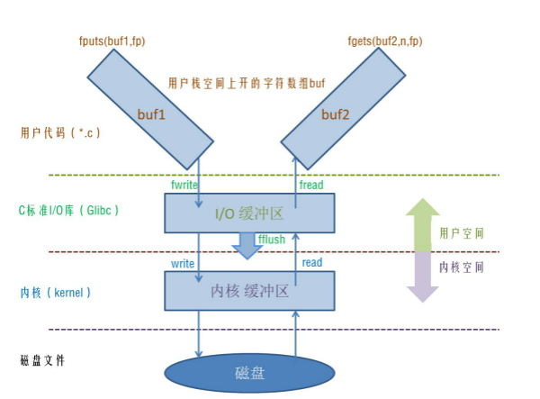
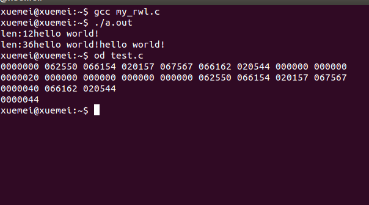

我们前面介绍了文件的创建、打开和关闭。下面我们就要对文件的内容进行操作了。最基础的就是读写文件了。

##系统调用——read

read系统调用，是从指定的文件描述符中读取数据。
```
#include<unistd.h>

ssize_t read(int fd, void *buf, size_t count);

调用成功返回读到的字节数，读到文件尾则返回0。错误返回-1；
```

参数count代表最多能读取的字节数，buf是，指将文件中的内容读取到buf所指向的缓冲区中（buf是地址）。我们在上一小节的代码中可以看到这个代码：
        
    read(fd, &recvdata, 100）;
    这个代码就是从已经打开的文件描述符（fd），读取最多100个字节（可以小于100）到recvdata所指向的内存中。


##系统调用——write

write系统调用，是给指定的文件描述符中写入数据。

```
#include<unistd.h>

ssize_t write(int fd, void *buf, size_t count);

调用成功返回写入数据的字节数，错误返回-1。
```

参数count类似read系统调用，代表写入文件的字节数。buf是指，将buf所指向的存储区的数据写入文件。我们可能会遇到该系统调用返回值小于count。原因是磁盘已经满了或者进程资源对文件大小的限制。


当然，有很多童鞋就会想，这些系统调用跟我们刚接触的C语言中的文件读写有什么区别呢？

其实很简单，c语言的函数是在stdio库中，他们属于用户态的函数，这些函数在底层调用的还是现在所展示的这些系统调用。




从这个图就能看出来它们之间的关系了吧？


#对文件的一些控制操作

##系统调用——lseek

OK，下面我们思考一个问题。我们能不能从文件中改或者读后一部分呢？答案是可以的。要实
现这个需求，我们必须要使用lseek这个系统调用。

在C语言中，我们使用指针，可以读取或者修改数组。在文件中，我们也有一个类似的概念，它叫“文件偏移量”。在我们读写文件，其实也是通过文件偏移量来实现的。每个打开的文件其实都有一个内核记录的偏移量。如果我们是从文件头来读写，那么文件偏移量就是0，完成读写后内核使其自增，直到到文件尾或者写完成.

我们可以使用lseek系统调用来改变文件偏移量。
```
#include<unistd.h>

off_t lseek(int fd, off_t offset, int whence);

调用成功返回文件新的偏移量，失败返回-1;
```

第一个参数是open系统调用后得到的文件描述符。offset指定了一个以字节为单位的数值。whence参数（简而言之就是设置起点）有如下几个：


SEEK_SET:

将文件偏移量设置为从文件起始点开始的offset个字节。

SEEK_CUR:

将文件偏移量设置为当前文件偏移量的offset个字节。绝对偏移量=当前文件偏移量+offset个字节。

SEEK_END:

将文件偏移量设置为起始于文件尾部（末尾字节的下一个算起）的offset个字节。

ps:offset可以是负值。例如：
```
lseek(fd, 0, SEEK_SET);
lseek(fd, 0, SEEK_END);
lseek(fd, -1, SEEK_END);
lseek(fd, -10, SEEK_CUR);
```
lseek通常能运用管道、FIFO、socket或者终端。调用失败将errno置为ESPIPE.感兴趣的童鞋可以查一下“文件空洞”。
举个例子吧：
```
#include <stdio.h>
#include <sys/types.h>
#include <sys/stat.h>
#include <fcntl.h>
#include <unistd.h>
#include <errno.h>
#include <stdlib.h>

void my_err(const char * err_string, int line)
{
	fprintf(stderr, "line:%d", line);
	perror(err_string);
	exit(1);
}


/*自定义的读数据的函数*/
int my_read(int fd)
{
	int	len;
	int	ret;
	int	i;
	char	read_buf[64];

	if(lseek(fd, 0, SEEK_END) < 0)
	{
		my_err("lseek", __LINE__);
	}
	
	if((len = lseek(fd, 0, SEEK_CUR)) < 0)
	{
		my_err("lseek", __LINE__);
	}
	if(lseek(fd, 0, SEEK_SET) < 0)
	{
		my_err("lseek", __LINE__);
	}

	printf("len:%d", len);
	if(read(fd, read_buf, len) < 0)
	{
		my_err("read", __LINE__);
	}	
	for(i = 0; i < len; i++)
	{
		printf("%c", read_buf[i]);
	}
	printf("\n");
}
	

int main()
{
	int fd;
	if((fd = open("test.c", O_CREAT|O_TRUNC|O_RDWR, 0666)) < 0)
	{
		my_err("open", __LINE__);
	}
	
	if(write(fd, "hello world!", 12) < 0)
	{
		my_err("write", __LINE__);
	}
	my_read(fd);

	if(lseek(fd, 12, SEEK_END) < 0)
	{
		my_err("lseek", __LINE__);	
	}
	write(fd, "hello world!", 12);
	my_read(fd);
	close(fd);
	return 0;
}
		
	
```

这个代码是这样的，我们先给文件中写入"hello world！"12个字节的数据。我们让文件偏移量向“后”偏移12个字节，然后再一次给文件中写入"hello world！"12个字节的数据。
下面是我们代码的运行图：


我们使用od命令查看文件数据，我们可以read系统调用可以返回数据'0'(其实是空字节)。大家不禁想了，为什么我们明明没有向文件中写这些数据，只不过是移动了下文件的偏移量，就会有这么多'0'？这是为什么？其实这就是文件空洞。

##系统调用——ioctl

如果大家曾经对可执行文件的内容查看过，那么就应该发现，里面是乱码。ioctl这个系统调用就是给可执行文件和设备操作文件提供了一种多用途机制。
```
#include<sys/ioctl.h>

int ioctl(int fd, int request, ...);

一般情况下，成功返回0，有的情况下会返回非负数。失败返回-1.
```

第一个参数是文件描述符fd（可能是设备文件描述符），第二个参数request指定了将在fd上执行的控制操作。第三个参数是是一个无类型指针内存。ioctl函数根据request参数来确定第三个参数所期望的类型。
```
#include <stdio.h>
#include <unistd.h>
#include <sys/ioctl.h>
#include <stdlib.h>
#include <sys/socket.h>
#include <netinet/in.h>
#include <arpa/inet.h>
#include <sys/types.h>
#include <net/if.h>
#include <string.h>


unsigned char g_macaddr[6];

void my_err(const char * err_string, int line)
{
	fprintf(stderr, "line:%d", line);
	perror(err_string);
	exit(1);
}

void init_net(void)
{
	int	i;
	int	sockfd;
	struct	sockaddr_in sin;
	struct	ifreq	ifr;

	sockfd = socket(AF_INET,SOCK_STREAM,0);
       	if(sockfd == -1)
         {
                  my_err("socket",__LINE__);
	 }

	strcpy(ifr.ifr_name, "eth0");
	printf("eth name:\t%s\n", ifr.ifr_name);

	//获取并打印网卡地址
	if(ioctl(sockfd, SIOCGIFHWADDR, &ifr) < 0)
	{
		my_err("ioctl", __LINE__);
	}
	memcpy(g_macaddr, ifr.ifr_hwaddr.sa_data, 6);

	printf("local mac:\t");
	for(i = 0; i < 5; i++)
	{
		printf("%.2x:", g_macaddr[i]);
	}
	printf("%.2x\n", g_macaddr[i]);


	//获取并打印IP地址
	if(ioctl(sockfd, SIOCGIFADDR, &ifr) < 0)
	{
		my_err("ioctl", __LINE__);
	}
	memcpy(&sin, &ifr.ifr_addr, sizeof(sin));
	printf("local eth0:\t%s\n", inet_ntoa(sin.sin_addr));


	/*获取并打印广播地址*/
	if(ioctl(sockfd, SIOCGIFBRDADDR, &ifr) < 0)
	{
		my_err("ioctl", __LINE__);
	}
	memcpy(&sin, &ifr.ifr_addr, sizeof(sin));
	printf("broadcast:\t%s\n", inet_ntoa(sin.sin_addr));


	/*获取并打印子网掩码*/
	if(ioctl(sockfd, SIOCGIFNETMASK, &ifr) < 0)
	{
		my_err("ioctl", __LINE__);
	}
	memcpy(&sin, &ifr.ifr_addr, sizeof(sin));
	printf("subnetmask:\t%s\n", inet_ntoa(sin.sin_addr));
}

int main(int argc, char *argv[])
{
	init_net();
	return EXIT_SUCCESS;
}
```
上面给出的是一个获取网络设备信息的程序，可能你还看不懂，不过没关系，等你看完后面的网络编程部分，你就能完全理解这个代码的含义了。

##系统调用——fcntl
fcntl系统调用可以对一个打开的文件描述符执行一系列控制操作。
```
#include<unistd.h>
#include<fcntl.h>

int fcntl(int fd, int cmd); 
int fcntl(int fd, int cmd, long arg); 
int fcntl(int fd, int cmd, struct flock *lock); 

返回值由cmd参数决定，失败返回-1，并设置errno位。
```
参数：   
fd：文件描述词。 

cmd：操作命令。 

arg：供命令使用的参数。 

lock：同上。 


有以下操作命令可供使用 

1. F_DUPFD ：复制文件描述词 。 

2. FD_CLOEXEC ：设置close-on-exec标志。如果FD_CLOEXEC位是0，执行execve的过程中，文件保持打开。反之则关闭。 

3. F_GETFD ：读取文件描述词标志。 

4. F_SETFD ：设置文件描述词标志。 

5. F_GETFL ：读取文件状态标志。 

6. F_SETFL ：设置文件状态标志。
    - 其中O_RDONLY， O_WRONLY， O_RDWR， O_CREAT，  O_EXCL， O_NOCTTY 和 O_TRUNC不受影响，可以更改的标志有 O_APPEND，O_ASYNC， O_DIRECT， O_NOATIME 和 O_NONBLOCK。 

7. F_GETLK, F_SETLK 和 F_SETLKW ：获取，释放或测试记录锁，使用到的参数是以下结构体指针：

    - F_SETLK：在指定的字节范围获取锁（F_RDLCK, F_WRLCK）或者释放锁（F_UNLCK）。如果与另一个进程的锁操作发生冲突，返回 -1并将errno设置为EACCES或EAGAIN。 
   
    - F_SETLKW：行为如同F_SETLK，除了不能获取锁时会睡眠等待外。如果在等待的过程中接收到信号，会立即返回并将errno置为EINTR。 

    - F_GETLK：获取文件锁信息。 

    - F_UNLCK：释放文件锁。 
    
    - 为了设置读锁，文件必须以读的方式打开。为了设置写锁，文件必须以写的方式打开。为了设置读写锁，文件必须以读写的方式打开。 

8. 信号管理 

    - F_GETOWN, F_SETOWN, F_GETSIG 和 F_SETSIG 被用于IO可获取的信号。 

    - F_GETOWN：获取当前在文件描述词 fd上接收到SIGIO 或 SIGURG事件信号的进程或进程组标识 。 

    - F_SETOWN：设置将要在文件描述词fd上接收SIGIO 或 SIGURG事件信号的进程或进程组标识 。 

    - F_GETSIG：获取标识输入输出可进行的信号。 

    - F_SETSIG：设置标识输入输出可进行的信号。 

    - 使用以上命令，大部分时间程序无须使用select()或poll()即可实现完整的异步I/O。 

9. 租约（ Leases） 
    - F_SETLEASE 和 F_GETLEASE 被用于当前进程在文件上的租约。文件租约提供当一个进程试图打开或折断文件内容时，拥有文件租约的进程将会被通告的机制。 

    - F_SETLEASE：根据以下符号值设置或者删除文件租约 

          - F_RDLCK设置读租约，当文件由另一个进程以写的方式打开或折断内容时，拥有租约的当前进程会被通告。 
          - F_WRLCK设置写租约，当文件由另一个进程以读或以写的方式打开或折断内容时，拥有租约的当前进程会被通告。 
          - F_UNLCK删除文件租约。 

    - F_GETLEASE：获取租约类型。 

10. 文件或目录改变通告 
（linux 2.4以上）当fd索引的目录或目录中所包含的某一文件发生变化时，将会向进程发出通告。arg参数指定的通告事件有以下，两个或多个值可以通过或运算组合。 
    - DN_ACCESS 文件被访问 (read, pread, readv) 
    - DN_MODIFY 文件被修改(write, pwrite,writev, truncate, ftruncate) 
    - DN_CREATE 文件被建立(open, creat, mknod, mkdir, link, symlink, rename) 
    - DN_DELETE 文件被删除(unlink, rmdir) 
    - DN_RENAME 文件被重命名(rename) 
    - DN_ATTRIB 文件属性被改变(chown, chmod, utime[s]) 

返回说明：   
成功执行时，对于不同的操作，有不同的返回值 

- F_DUPFD： 新文件描述词 
- F_GETFD：  标志值 
- F_GETFL：  标志值 
- F_GETOWN： 文件描述词属主 
- F_GETSIG： 读写变得可行时将要发送的通告信号，或者0对于传统的SIGIO行为对于其它命令返回0。 

失败返回-1，errno被设为以下的某个值
 
- EACCES/EAGAIN: 操作不被允许，尚未可行 
- EBADF: 文件描述词无效 
- EDEADLK: 探测到可能会发生死锁 
- EFAULT: 锁操作发生在可访问的地址空间外 
- EINTR: 操作被信号中断 
- EINVAL： 参数无效 
- EMFILE: 进程已超出文件的最大可使用范围 
- ENOLCK: 锁已被用尽 
- EPERM:权能不允许


下面是flock的结构：
```
struct flock {
             short l_type; /* 锁类型： F_RDLCK, F_WRLCK, F_UNLCK */
             short l_whence; /* l_start字段参照点： SEEK_SET(文件头), SEEK_CUR(文件当前位置), SEEK_END(文件尾) */
             off_t l_start; /* 相对于l_whence字段的偏移量 */
             off_t l_len; /* 需要锁定的长度 */
             pid_t l_pid; /* 当前获得文件锁的进程标识（F_GETLK） */
};

```


##系统调用——dup/dup2

我们有时候需要使用不同的文件描述符来表示同一个文件，那么我们应该怎么做呢？我们可以使用dup/dup2来复制文件描述符。
```
#include<unistd.h>

int dup(int oldfd);

成功时返回一个新的文件描述符，失败返回-1，并设置errno位。
```
```
#include<unistd.h>

int dup2(int oldfd, int newfd);

成功时返回newfd的值，失败返回-1，并设置errno位。

```
举个例子：
```
#include<sys/types.h>
#include<sys/stat.h>
#include<stdio.h>
#include<stdlib.h>
#include<errno.h>
#include<unistd.h>
#include<fcntl.h>
#include<string.h>

int main(int argc , char * argv[])  {
    char * buf = "hello world!";
    int fd = open("1.test" , O_CREAT | O_RDWR , 0766 );
    printf("Create a new file , FD = %d\n", fd);
    write(fd, (void *)buf, strlen(buf));
    close(fd);

    fd = open("1.test", O_APPEND | O_RDWR ,0766);
    int newfd = dup(fd);
    printf("After dup function. return value = %d\n", newfd);
    write(newfd, (void *)buf, strlen(buf));
    close(newfd);

    fd = open("1.test", O_APPEND | O_RDWR ,0766);
    int thirdfd = dup2(fd, 1000);
    printf("After dup2 function.The new FD = %d\n", thirdfd);
    write(1000, (void *)buf, strlen(buf));
    close(1000);
    return EXIT_SUCCESS;
}


```

我们可以先创建一个名为"1.test"的文件，向里面写入数据，然后我们用dup系统调用获得一个新的文件描述符并写入数据，最后我们调用dup2系统调用向里面写入数据。