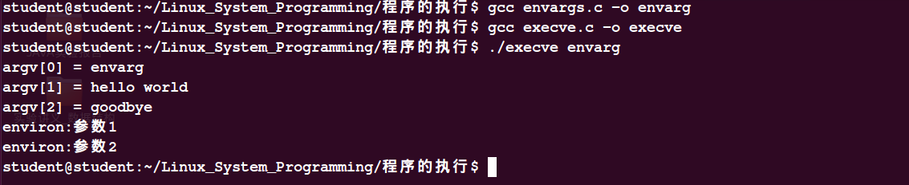

# 新程序的执行

### 一：execve()
之所以叫新程序的执行，原因是这部分内容一般发生在`fork()`和`vfork()`之后，在子进程中通过系统调用`execve()`可以将新程序加载到子进程的内存空间。这个操作会丢弃原来的子进程`execve()`之后的部分，而子进程的栈、数据会被新进程的相应部分所替换。即除了进程ID之外，这个进程已经与原来的进程没有关系了。
举个例子：在`shell(shell也是一个进程)`中执行最简单的`HelloWorld`程序。它也是首先调用`execve()`这个系统调用的，下面用`strace`跟踪下执行`HelloWorld`的过程，我们可以看到第一步执行的是`execve()`。省略了后面信息，如图：

实际上`Hello`进程的父进程是`shell进程`，它是`shell进程`fork出来的一个子进程然后执行`execve`之后在执行的`Hello`，所以我们下面来看看这个`execve`:
```
#include <unistd.h>
int execve(const char *filename, char *const argv[],
                  char *const envp[]);
```
- filename:包含准备载入当前进程空间的新程序的路径名。既可以是绝对路径，又可以是相对路径。
- argv[]:指定了传给新进程的命令行参数，该数组对应于c语言main函数的argv参数数组，格式也相同，argv[0]对应命令名，通常情况下该值与filename中的basename(就是绝对路径的最后一个)相同。
- envp[]:最后一个参数envp指定了新程序的环境列表。参数envp对应于新程序的environ数组。


还要注意的是：由于是将调用进程取而代之，因此对`execve`的调用将永远不能返回，也无需检查它的返回值，因为该值始终为`-1`，实际上，一旦返回就表明了错误，通常会有error值来判断，下面是几个常用的：
- EACCES：参数pathname没有指向一个常规文件，未对该文件赋于可执行权限，或者因为目录没有`x`权限。
- ENOTNT：pathname指定的文件并不存在。
- ETXTBSY：存一个或者多个进程已经以写入的方式打开pathname所指定的文件。


下面我们举个例子说明execve的用法：
`filename:execve.c`
```
#include<stdio.h>
#include<unistd.h>
#include<sys/types.h>
#include<string.h>

int main(int argc,char *argv[])
{
    char *argVec[10];                               //参数数组
    char *envVec[] = {"环境参数1","环境参数2",NULL};  //环境变量数组
    argVec[0] = argv[1];
    argVec[1] = "hello world";
    argVec[2] = "goodbye";
    execve(argv[1],argVec,envVec);        //分别传入三个参数
    return 0;
}
```
`filename:envargs.c`
```
#include<stdio.h>
#include<stdlib.h>
extern char ** environ;
int main(int argc,char *argv[])          //argv[]相当于上面的argvec[]
{
    int j;
    char **ep;
    for(j = 0;j < argc;j++) {
        printf("argv[%d] = %s\n",j,argv[j]);
    }
    for(ep = environ;*ep != NULL;ep++) {    //environ是上面的envVec[]
        printf("environ:%s\n",*ep);
    }
    exit(EXIT_SUCCESS);
    return 0;
}
```

### 二：exec()函数族
实际上有关exec是一个函数族，包括`execle`,`execlp`,`execvp`,`execv`,`execl`但是他们具体的实现都是调用execve()之上。它们的区别就在于对路径名，参数以及环境变量的指定上。下面分别从这三个方面来区分这几个函数：
- 路径名：带`p`的表示可以通过环境变量PATH去查找，所以我们可以不用绝对路径，比如execlp和execvp就可以直接用filename。
- 参数：带`l`的execle()和execlp()以及execl()要求在调用中以字符串形式指定参数。首个参数相当于新程序main中的argv[0],因而通常与filename中的basename相同(就是绝对路径的最后一个)。
- 环境变量：以`e`结尾的允许我们通过envp为新程序显式的指定环境变量，其中envp必须以`NULL`结尾。


下面我们通过这个表格来介绍exec()函数族之间的差异：


|函数        |执行程序文件|参数        |环境变量    |
|------------|------------|------------|------------|
|execve()|路径名|数组|envp参数|
|execle()|路径名|列表|envp数组|
|execlp()|文件名|列表|调用者environ|
|execvp()|文件名|数组|调用者environ|
|execv()|路径名|数组|调用者environ|
|execl()|路径名|列表|调用者environ|


