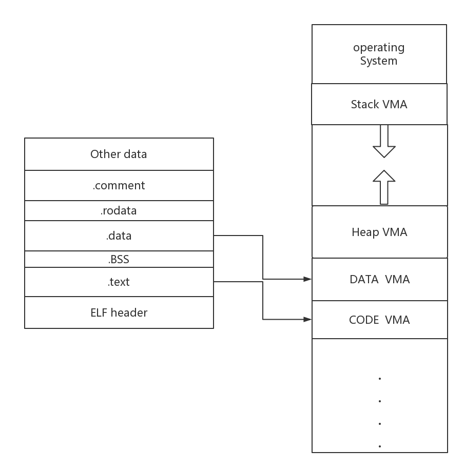
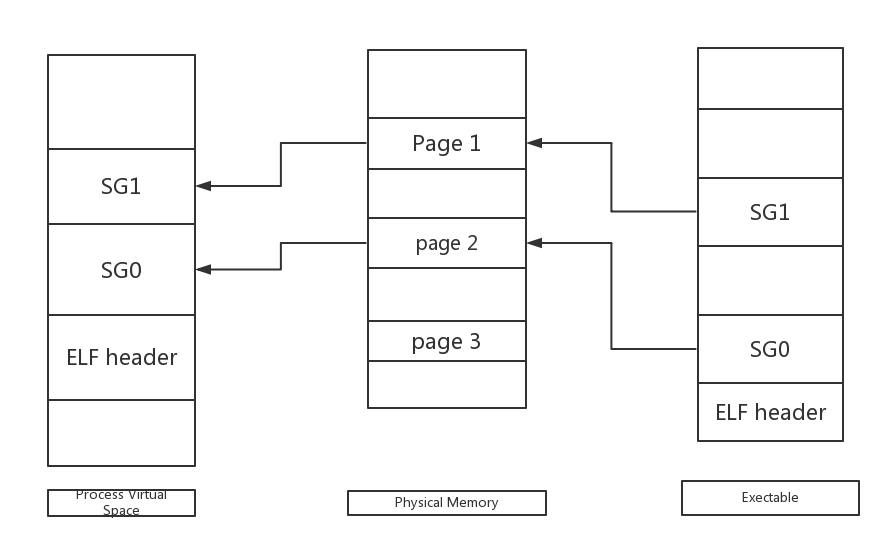

# C程序&&进程及其内存布局
##概述
	进程的概念前边已经介绍了，进程就相当于是程序的生命，进程就是一种载体，它承载着程序，尤其是对于操作系统而言进程更是核心内容，
	如果没有进程这种抽象，那么操作系统的所有在运行的程序将会变的混乱不堪，整个资源的分配也将是混乱的，所以为了整齐且高效的管理这些程序，“进程”这个概念顺势诞生，
	进程就是操作系统对一切可以执行，将要执行，正在执行的程序统称，只是进程还有很多很多的状态。比如运行状态，可中断等待状态，不可中断等待状态，僵死状态，停止状态。
	这些状态你现在只要知道即可，不需要深入的了解。后边会深入的讲解这几种状态的异同以及用法。
    既然进程被抽象了出来那么，它的很多东西应当被“规范起来”，这样的抽象才有价值。
    我们现在就来看看进程的内存布局。不过我们需要先看看C程序的内存布局。
##C程序的内存布局：
	C可执行程序的内存布局如图：

	在分别介绍这些每一行这些东西之前我们需要了解“段”这个概念，如果你没有听说过这个概念，至少你应该听说过“段错误”，“段错误”就是内存发生了错误，那么这个“段”肯定和内存有关。
	段在UNIX 与 Linux 程序中表示一个二进制文件的相关的内容块。补充一下，在Inter x86 内存模型中，段表示一种设计的结果。
	地指空间并不是一个整体而是分成一些64K大小的区域，称之为段。后边这个补充的内容了解下就好。我们现阶段乃至全本书所讲的“段”都是指二进制文件，或者内存中的一个内容块。
	段的概念在8086CPU上体现的更加淋漓尽致，它和汇编语言渊源极深。
	对于一个可执行程序大体上分为：

BSS段
----

		通常用来存放程序中未初始化的全局变量的一块区域，属于静态内存分配。

data段：
------

		数据段通常是指用来存放程序中已经初始化的全局变量的一块区域，数据段属于静态内存分配。

text段：
------

		代码段通常是指用来存放程序执行代码的一块内存区域。
		这部分区域的大小在程序运行前就已经确定了，并且内存区域通常属于只读，
		某些架构也允许代码段为可写，即允许修改程序。在代码段中，也能包含一些只读的常数常量，例如字符串常量。

rodata段：
--------

		存放C中的字符串和#define定义的常量。

heap段：
------

		堆是用来存放进程运行中被动态分配的内存段，它的大小并不确定，可以动态的扩张或者缩减。当我们使用malloc函数族的时候其实就是在这个堆中取的空间；
		必然的使用free等函数释放这些空间后，被释放的内存空间从堆栈中被剔除（堆被缩减），在32位环境下大约堆最大可以分配的大小约为2.9G。
		这个大小和具体的环境有关，这2.9G 的空间其实并非是真实的大小，这是程序的逻辑地址大小，是虚拟的内存空间大小。现在只要由这个概念就好。

stack段：
-------

        用户存放程序临时创建的局部变量，通俗来说就是函数{}中定义的变量（但是不包括static声明的变量，static意味着在数据段中存放变量，
        枚举类型同样不在其中，考虑内存对齐可知不论枚举多少个元素，一个枚举始终只占一个整形）
        除此之外，在函数被调用时，其参数也会被压入发起进程调用的进程栈中，并且待到调用结束后，函数的返回值也会被存放回栈中。
        由于栈由先进先出的特点，所以方便用来保存与恢复调用现场，所以我们可以把堆栈看成是一个寄存交换临时数据的内存区。

comment段：
--------

		这个段主要存放的就是编译器版本的信息，eg:GCC:(GNU)5.1.0.

其他段
---

	其实除了这些还有很多其他的段，非常多，内容也很丰富，我就不在这里一一赘述了。简要说几个可能比较常用的吧。
	.ELF header:
			它描述整个文件的基本属性，比如ELF文件版本，目标机器型号，程序入口地址等。
	.debug段:
			包含调试信息。
	.line段：
			调试时的行号，即源代码行号与编译后指令的对应表。
	.hash段：
			符号哈希表。
	.strtab段：
			String Table :字符串表，用于存储ELF文件中用到的各种字符串。
###一个小例子描述C内存布局：

int globe_a = 0;         // 全局初始化区(data)
char *p1;                       // 全局未初始化区(bss)
int main()
{
    int b;                      // 栈区(stack)
    char s[] = "i love linxu " ; // 栈区(stack)
    char *p2;                   // 栈区(stack)
    char *p3 = "123456";        // p3 在栈区(stack);   "123456\0" 在常量区(rodata)  //这个很重要
    static int c =0;            // 全局/静态 初始化区  (data)
    p2 = (char *)malloc(20);    // 分配得来的 10 和 20 字节的区域就在堆区 (heap)
    strcpy(p1, "123456");       // "123456\0" 放在常量区(rodata). 编译器可能会将它与 p3 所指向的"123456\0"优化成一个地方（BSS）
    return 0;
}
这些只是一些变量的存放，详细内存分配见V1.5 or V2.0
进程的内存空间布局
---------

	其实进程的内存空间布局和我们之前讲的C可执行文件（ELF）很类似.
	如图：

    首先进程的存储空间时放在主存上的，其实这是一个映射的关系，在一个C语言源程序被编译成可执行文件中，就存在虚拟地址分配这个动作，虚拟地址分配，
    以及链接和符号重定向等等一些列的动作。当这些东西完成后，我们就得到了可执行文件（ELF），这个可执行文件的布局我们上边已经谈到过了。
    当然，这个文件现在就是可执行的，当它被操作系统执行后，它就具有了生命，编程了一个进程。这个时候它的各个“段“就被映射在了内存上。
    CPU 找到 __START 指令，这个程序从此就算是“跑“起来了。（ps:__START 现在你理解成main 就好，一个正常的程序确实是从main开始的）。而这种映射关系也就成为了进程的内存布局。
	现在为我们较为详细的讨论下进程的启动以及内存分配：
	进程的启动基本需要三个步骤：
	1.创建一个独立的虚拟地指空间
	2.读取可执行文件头（ELF header),并且建立虚拟地指空间和可执行文件的映射关系。
	3.将CPU 的指令寄存器设置成可执行文件的入口地址，启动运行。
	有此可见，进程的内存布局基本就是将可执行文件映射到内存上罢了，先有个印象就好，以后V1.5 or V2.0 会详细解析。
