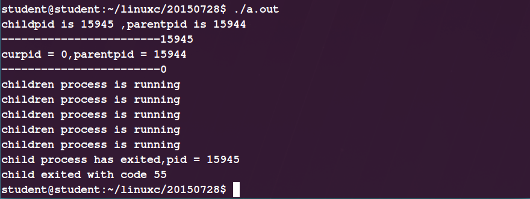

# 父进程等待子进程结束

我们一直在强调一个概念就是**进程是一个程序执行的实例，是内核在虚拟概念下创建的实体，它实例化的体现在用户态就是程序代码和代码使用的变量(存储空间)，在内核态就是内核为我们每个进程所保存的数据结构(状态信息)等。**
当一个进程由于某种原因停止时，内核并不是直接将为它保存的状态信息从内核移除，相反，进程会一直被保持在一种已经终止的状态，直到被它的父进程回收，当父进程回收已经终止的子进程时，内核会将子进程的退出状态传递给父进程，然后抛弃已经终止的进程，从此刻开始，这个进程才会消失，一个子进程结束但是还没有被父进程回收的进程叫做"僵尸进程"，要是父进程先于子进程结束，那么它的子进程就会称为"孤儿进程",最终会被PID为1的init进程收养。什么？init进程？好眼熟，对，它是我们引入进程的概念时候提过的。下面我们将介绍父进程等待子进程结束的两个函数，wait()和waitpid()函数。
首先我们来看下man wait的内容：
```
#include <sys/types.h>
#include <sys/wait.h>
pid_t wait(int *status);  //status表示退出状态，指向子进程的退出码
返回：如果成功，返回子进程的ID；如果失败，返回-1。
pid_t waitpid(pid_t pid, int *status, int options);  //option可选择设置waitpid不堵塞
返回：如果成功，返回子进程的ID；如果option设置为WNOHANG,则为0；如果其他错误，则为-1。
```
### waitpid()函数：
默认的，当option参数为0的时候，它挂起等待一个子进程的结束；如果子进程中一个进程在刚调用的时候就已经结束了，那么waitpid()就会立即返回，如果正常情况下，这两种都会返回已经终止的进程的PID,并且将这个进程从系统中去除。下面我们再来详细介绍下它的三个参数：

（1）：pid：判定等待集合的成员
pid > 0 : 表示等待集合中进程号为pid的特定子进程。
pid = -1 : 表示等待进程的任意一个子进程。
pid = 0 : 表示等待其组ID等于调用进程的组ID的任意一个进程。

（2）：status:检查已回收的子进程的退出状态，主要是利用wait.h头文件中的几个宏来检测。
WIFEXITED(status) : 如果子进程通过调用exit或者return正常终止，那么就返回真。
WEXITSTATUS(status) : 返回一个正常终止的子进程的退出状态，返回子进程中exit或_exit的低八位。
WIFSIGNALED(status) : 若子进程异常终止，它就取得一个非零值，表示真。

（3）：options : 修改默认行为，介绍最常用的一个。
WNOHANG : 如果等待集合中的任意一个子进程都还没有终止，那么就立即返回，（返回值为0），默认的行为是挂起调用进程等待，直到有子进程结束，这样可以避免阻塞，我们还可以在等待子进程结束的同时干点别的什么事。
下面我们来看一段代码：
```
#include<stdio.h>
#include<sys/types.h>
#include<sys/wait.h>
#include<errno.h>
#include<unistd.h>
#include<stdlib.h>

int main(int argc,char *argv[])
{
    pid_t pid;
    int status;

    printf("Hello\n");
    pid = fork();
    if(pid != 0) {
        if(waitpid(-1,&status,0) > 0) {
            if(WIFEXITED(status) != 0) {
                printf("%d\n",WEXITSTATUS(status));
            }
        }
    }
    printf("Bye\n");
    exit(100);
}
```

输出为什么是4行大家懂不懂呢，首先输出Hello没有什么解释的，然后在fork之后我们可以看做有两份一样的代码分别属于父进程和子进程，然后子进程输出Bye,此时的父进程已经被挂起等待子进程的结束，然后子进程100退出码退出，此时父进程结束挂起状态，WEXITSTATUS(status)输出退出码，接着向下执行，再次输出Bye!

错误条件：如果调用进程没有子进程，那么waitpid()函数返回-1，并且设置errno的值为ECHILD;如果waitpid()函数被一个信号中断，那么返回-1,并且设置errno的值为EINTR。举个例子：
```
#include<stdio.h>
#include<sys/types.h>
#include<sys/wait.h>
#include<errno.h>

int main(int argc,char *argv[])
{
    pid_t pid;
    int status;
    pid = waitpid(-1,&status,0);

    printf("pid is %d\n",pid);
    if(errno == ECHILD) {
        perror("waitpid");
    }
}
```

我们可以看到对于没有子进程的进程如果调用waitpid()函数的话返回-1,并且将errno值设置为ECHILD,我们可以用perror()函数打印出来错误原因是没有子进程。

### wait()函数
介绍完waitpid()函数，wait()函数实际上就不用多说了，它是waitpid()函数的简单版本

wait(status) = waitpid(-1,&status,0)。来段代码练练手：
```
#include<stdio.h>
#include<sys/wait.h>
#include<sys/types.h>
#include<unistd.h>
#include<stdlib.h>

int main(int argc,char *argv[])
{
    int     pid;
    char    *msg;
    int     k;
    int     exit_code;

    pid = fork();
    switch(pid){
        case 0:{
            printf("curpid = %d,parentpid = %d\n",pid,getppid());
            msg = "children process is running";
            k = 5;
            exit_code = 55;
            break;
        }
        case -1:{
            perror("process creat failed\n");
            exit(-1);
        }
        default:{
            printf("childpid is %d ,parentpid is %d\n",pid,getpid());
            exit_code = 0;
            break;
        }
    }
    printf("------------------------%d\n",pid);
    if(pid != 0)
    {
        int   stat_val;                         // 值为0
        int   child_pid;

        child_pid = wait(&stat_val);     //wait函数的返回值是终止运行的子进程的pid, 遇到wait函数之后开始执行子进程.
        printf("child process has exited,pid = %d\n",child_pid);
        if(WIFEXITED(stat_val)){
            printf("child exited with code %d\n",WEXITSTATUS(stat_val));
        }
        else {
            printf("child exited abnormally\n");
        }
    }
    //让子进程暂停5秒
    else
    {
        while(k-- > 0)
        {
            puts(msg);
            sleep(1);
        }
    }
    exit(exit_code);
}

```

我们首先fork一个子进程，然后子进程执行的是case 0 中的代码以及下面else中的代码，父进程执行default中代码和下面if中的代码，但是父进程到wait函数的时候就会挂起来等待子进程的结束。子进程连续输出5次msg的内容之后退出，exit_code=55；这个会被父进程中的 WEXITSTATUS(stat_val) 检测到。


