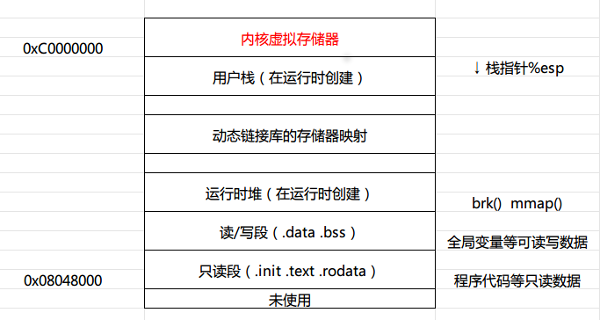
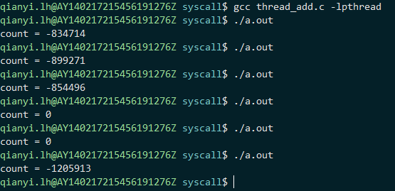
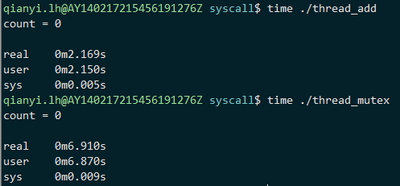

# 线程的互斥与同步

在进程章节我们描述了进程眼中的线性地址空间，一个进程在线性地址空间中的布局大致如下：



这个进程创建的所有线程都会共享其创建的这个虚拟地址空间、文件系统资源、文件描述符、信号处理程序以及被阻断的信号等资源。不过虽然共享地址了空间，但是每个线程还是有自己的私有数据的，比如每个线程都有自己的栈空间，其位置一般会在运行时堆以上。多个栈的分布可能会和动态链接库的映射位置交织在一起，具体要看操作系统内核是如何映射动态链接库的。

换句话说，线程之间访问的内存地址空间是共享的。所以只要能传递变量的指针，线程就可以相互之间操作相同的数据。比如哪怕是A线程在函数体内定义的变量都可以被另一个线程修改，当然，这么做是有风险的。我们会在本教程的后续版本里介绍函数调用与局部变量和线程安全相关的内容。

接下来是一个具体例子，我们来看看共享数据的访问会造成什么样的问题。

```c
#include <stdio.h>
#include <stdlib.h>
#include <pthread.h>

int count = 0;

void *thread_func(void *args)
{
    int i;
    for (i = 0; i < 100000000; ++i) {
       count--;
    }
    return NULL;
}

int main(int argc, char *argv[])
{
    pthread_t tid;

    int rc = pthread_create(&tid, NULL, thread_func, NULL);
    if (rc < 0) {
        perror("create thread error: ");
        return -1;
    }

    int i;
    for (i = 0; i < 100000000; ++i) {
        count++;
    }
    
    pthread_join(tid, NULL);

    printf("count = %d\n", count);

    return 0;
}
```

代码很简单，主线程对全局变量count做++操作，而子线程对一个变量做--操作。因为++操作和--操作的数量是一样多的。所以很容易就能判断出count的结果是0对吧？这个推理是没有错的，但是编译执行后的结果就有点无法理解了。如图：



运行了多次，居然结果不确定。有的结果符合预期，有的却很奇怪。正确的结果是0没错，但为什么异常的结果都是随机的？

原因出在变量的加减操作上，看似简单的变量加减操作并不是我们想想的那么简单。学过计算机导论的同学都知道，现代的计算机对内存中的一个变量做加减运算的时候，并不是直接在内存中进行的。而是会将这个变量从内存中读取到CPU的寄存器中进行读写操作，然后写回到内存中去的。也就是说，看似简单的一个加操作，实际上经历了内存->寄存器、寄存器+1、寄存器->内存这么三个步骤（此处简化过程，不考虑cache等影响）。怎么证明呢？把编译后的代码反汇编出来看看吧。

这里采用objdump命令对编译出的目标文件进行反汇编。

```shell
gcc -c -g thread_add.c
objdump -S thread_add.o
```

这里使用-c产生目标文件进行反汇编而不是最终编译出可执行文件进行反汇编的原因是避免输出很多和上面代码无关的CRT代码的反汇编指令。这里的gcc使用-g参数要求产生调试信息，这样之后的objdump的-S参数就能尽可能的把C源码和汇编指令进行对应以便于分析（这也是一种学习编译和汇编语言的方法哦）。

如图所示，count++这行C语言代码翻译为汇编语言之后是这样的：


可能你看不懂汇编语言，但是也能看出count++这个简单的C语句是被翻译成三条汇编指令的（有的时候这里一条汇编指令也可以，比如count是函数的局部变量）。

那么，大家不妨想一想。两个同时独立执行这三个步骤的线程有没有可能在某一个时刻产生冲突？假如count现在是0，线程A要做加操作，数值0从内存读到了寄存器A里加1变成了1，而线程B正巧要做减操作，数值0也从内存里读到了寄存器B里减一变成了-1.此时A线程把1从寄存器写回内存为1，B线程把-1写回内存为-1.然后，悲剧就这么发生了，倘若线程A执行完了加1操作的三个步骤之后，线程B来做减1操作，count的结果肯定也是0.但是一起做这件事情，就发生了并行操作的错误结果。

这种冲突是不可预知的，我们也没有办法预测冲突的次数和某次执行是否发生的概率。这不仅仅与CPU的工作原理相关，也和操作系统内核对线程的执行调度相关。

接下来引入一个术语叫原子操作（atomic operation），其表面含义就是不可再分的操作。不可再分的操作为什么叫“原子”呢？因为提出来这个概念的时候，当时的物理学上认为物质最小的组成就是“原子”，且不可再分了。当然，还有比原子更小的物质，但是这个术语就沿用下来了。如果一系列操作是不可再分的，那么就称之为原子操作。要注意这里的“原子操作”并非只能有一个步骤，即使有多个步骤，只要操作系统或者CPU能保证这一系列步骤是不会被别的步骤交织的，也是原子操作。比如说，上述变量的操作尽管是三个步骤。但如果操作系统和CPU能保证对其加减是独立完成的，那也就是一个原子的加减。

不过在Linux 2.6.18之后，在用户态不提供原子操作的封装了，继而推荐使用gcc编译器提供的原子封装函数进行操作。代码修改后如下：

```c
#include <stdio.h>
#include <stdlib.h>
#include <pthread.h>

int count = 0;

void *thread_func(void *args)
{
    int i;
    for (i = 0; i < 100000000; ++i) {
        __sync_sub_and_fetch(&count, 1);
    }
    return NULL;
}

int main(int argc, char *argv[])
{
    pthread_t tid;

    int rc = pthread_create(&tid, NULL, thread_func, NULL);
    if (rc < 0) {
        perror("create thread error: ");
        return -1;
    }

    int i;
    for (i = 0; i < 100000000; ++i) {
         __sync_add_and_fetch(&count, 1);
    }
    
    pthread_join(tid, NULL);

    printf("count = %d\n", count);

    return 0;
}
```

其实也就是在原先++和--的地方换成了gcc的内置函数而已，因为是gcc内置函数，也就不用加头文件了。那么gcc这两个内置函数施了什么魔法呢？答案就是——暂时不告诉你。先知道这么做可以就好了，等到你学习了计算机原理和基本的汇编语言之后，本教程的高级版会慢慢介绍的。什么？你会反汇编自己学习了？太好了，简直棒棒哒。不过我就不展开讲了。

貌似到这里问题解决了是吧？但是好像没有覆盖所有的需求场景，比如有时候我需要修改一个结构体的好多信息，而且在一个线程没有修改完之前，绝对不能有别的线程修改这个结构体的任何数据。这个需求看起来上面的原子操作函数就排不上用场了。那Linux的pthread库有没有比较一般性的机制来实现这种需求呢？当然有，那就是mutex（互斥锁）。

先给出4个最最基本的mutex相关的函数，其他函数这章暂不介绍。

```c
#include <pthread.h>

int pthread_mutex_init(pthread_mutex_t *restrict mutex,
              const pthread_mutexattr_t *restrict attr);

int pthread_mutex_destroy(pthread_mutex_t *mutex);

int pthread_mutex_lock(pthread_mutex_t *mutex);

int pthread_mutex_unlock(pthread_mutex_t *mutex);

```

定义一个pthread_mutex_t类型即定义了一个mutex。pthread_mutex_init和pthread_mutex_destroy分别对这个类型进行初始化和销毁操作（资源释放）。其中pthread_mutex_init第二个参数是pthread_mutexattr_t类型的指针，用于给mutex设置特殊属性，如果不需要特殊属性（比如本章），直接用下面的初始化方式即可。

```c
pthread_mutex_t mutex = PTHREAD_MUTEX_INITIALIZER;
```

那mutex怎么用呢？回到上一个例子，下面给出使用mutex修改的代码：

```c
#include <stdio.h>
#include <stdlib.h>
#include <pthread.h>

int count = 0;

pthread_mutex_t mutex = PTHREAD_MUTEX_INITIALIZER;

void *thread_func(void *args)
{
    int i;
    for (i = 0; i < 100000000; ++i) {
        pthread_mutex_lock(&mutex);
        count--;
        pthread_mutex_unlock(&mutex);
    }
    return NULL;
}

int main(int argc, char *argv[])
{
    pthread_t tid;

    int rc = pthread_create(&tid, NULL, thread_func, NULL);
    if (rc < 0) {
        perror("create thread error: ");
        return -1;
    }

    int i;
    for (i = 0; i < 100000000; ++i) {
        pthread_mutex_lock(&mutex);
        count++;
        pthread_mutex_unlock(&mutex);
    }

    pthread_join(tid, NULL);

    printf("count = %d\n", count);

    pthread_mutex_destroy(&mutex);

    return 0;
}
```

抛开初始化和销毁，好像也没有什么复杂的么。不过是在操作共享的数据之前加上了锁，操作结束之后解掉了锁。看起来好像没有之前那个原子操作的例子简单是吧。但是，mutex的应用场景更一般化一些。比如这里的lock和unlock之间完全可以有很多行代码，操作多个具有关联性的数据。比如“转账”这个场景，需要从A帐号扣除金额后添加到B账户。那么就需要A-和B+这个关联操作一起发生，而不是A-之后B还没加上去就发生了对A或B的其它操作（只是个例子，现实的场景肯定用事务实现。啥是事务？额...我啥也没说，刚刚是幻觉）。

但是，可能你会问。没有这个锁，就没法对刚刚那个count进行操作吗？看起来这个mutex没有和count建立什么关联啊。没错，有没有这个mutex，和操作count没有一点关系。这里一定要理解，**mutex只是用来实现同步的逻辑的机制，不是强制保护某类资源的机制**。

可以这么理解：有个变量flag初始为0，主线程判断flag为0则count++，然后flag赋值1，循环；子线程判断flag为1则count--，然后flag赋值为0，循环。这样看起来也能实现是吧？但是呢，如果flag的赋值操作是原子的，那么这一假设是成立的。但可惜不是，如果有多个线程执行这个逻辑，对flag的赋值会出现并发的错误，就行对count进行并发操作一样。mutex这个东西就像是操作系统提供给我们的一种“flag”机制，而mutex的lock和unlock操作保证是原子的，所以就保证了用mutex作为“flag”的正确性。那能否使用原子操作的flag实现呢，当然可以的。不过mutex在进行lock操作时，如果短暂的等待后发现别的代码已经lock了mutex且没有unlock，会挂起当前线程进入休眠状态，以免忙等待白白空耗CPU资源。那存在这种使用原子变量进行“加锁”操作的机制呢？还真有，叫做spin_lock（自旋锁），如果lock失败会进入循环判断，不断的尝试lock操作。不过这里就不展开讲了，有兴趣请自行了解（当然也可以自己尝试实现一个简单的spin_lock，很简单的）。

这样理解了吧？mutex并不是强制“锁住”了某些变量无法修改，它仅仅是一个可以原子修改状态的“flag”罢了。理解到这里，你就能利用这个“flag”实现很多同步场景了。这篇作为入门，点到为止。之后的版本会给出真正有价值有意义的代码。

结束mutex前罗嗦一下，单变量的话可以用原子变量就不要用mutex了，比如计数器count之类。为什么呢？看看下面的简单性能测试就知道了。



这里用time命令简单测试一下这两个程序执行的效率。显而易见，原子变量的版本的执行效率比mutex是要好很多的（简单对比，不分析cache之类的影响）。

其实线程/进程间的同步机制有很多种，如果一个一个介绍起来估计理解和区分的难度比较大。这里就不展开介绍了，后面讲到实际的需求时，再逐渐一个一个引入吧。有实际的场景的话，学习起来应该更有兴趣，印象也更深刻。
