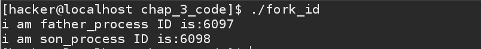
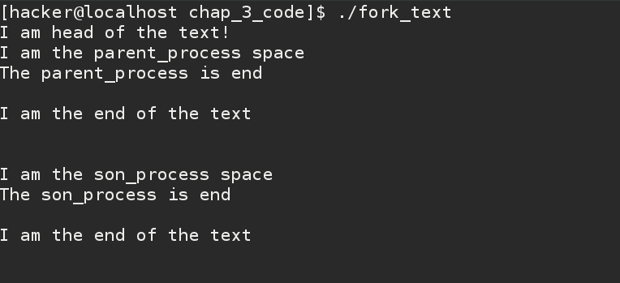
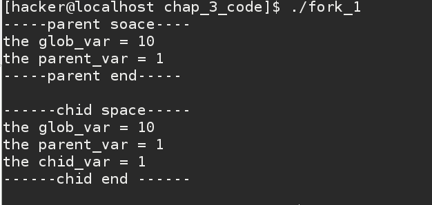
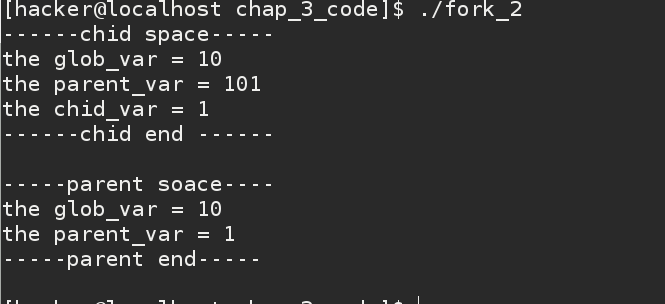

#进程创建
##前言
    在前边我们已经了解了，进程的基本概念，C语言的内存布局，简单的进程在内存空间的布局，接下来我们就要正式进入进程的学习了。
###学习目标
1.进程的数据结构--进程描述符

2.几个简单的获取进程ID 函数

3.创建进程函数--fork() ,vfork()函数 

4.程序设计之--进程启动程序

5.练习题--别怕，熟能生巧

###进程的数据结构--进程描述符
   我们知道一台正在运行中的电脑可以执行很多任务，比如你在打LOL，听音乐，看新闻，或者和某个人聊着天，这些动作都是不同的且独立运行着的进程，这么多的进程，电脑或者说操作系统是如何管理它的呢？ 其实大体上的管理方式是使用一种我们都学过的数据结构--循环链表。
   
   内核把进程的列表存储在一个叫做任务对列（task_list ）的双向循环链表中，链表中的每一项都是类型为 task_struct ，称为进程描述符的结构中。
   
```
struct task_struct{
    volatile long state;  //表示进程的状态 0：可运行 -1：不可运行 >0 :停止
    void *stack;          //进程的内核栈
    int lock_depth;       //大内核锁的深度
    int prio;             //进程的动态优先等级
    int static_prio;      //进程的静态优先等级，可以被nice 改变
    int normal_prio;      //进程的普通优先等级
    const struct sched_class *sched_class; 
    //进程所调度的函数的集合
    struct list_head tasks;    //进程链表
    struct list_head children; //子进程链表
    struct list_head sibling;  //链接到父进程的子进程的链表
    struct fs_struct *files;   //进程打开文件描述符的情况
    pid_t pid;                 //进程的ID***
    。
    。
    。
```

这是我从内核源码中截取的一部分，主要是一些可能常见的后边能接触到的属性，更重要的是理解这个结构是什么，它做了什么。
以后介绍抽象的东西我都会给一个小结。

小结：

    进程描述符包含了内核管理一个进程所需要的所有信息，进程描述符中包含的数据结构能完整地描述一个正在执行的程序：
    它打开的文件，进程的地址空间，挂起的信号，进程的状态，以及其他一些信息，抓住了进程描述符，你提住了进程的纲领。

###几个简单的获取进程ID的函数
```

pid_t getpid(void);     //返回调用进程的ID

pid_t getppid(void);    //返回调用进程的父进程ID

pid_t getuid(void);      //返回用户的实际ID

pid_t geteuid(void);     //返回调用进程有效ID

pid_t getgid(void);      //返回调用进程的组ID

pid_t getegid(void);     //返回调用进程的有效组ID

```   


###进程的创建
####fork() 函数--进程创建 
    说了那么多的东西，我们终于可以开始介绍进程的创建函数了。
        fork()函数，它是一个系统调用函数，一个现有的进程可以调用这个函数创建一个新的进程。
        由fork( )函数创建的新进程被称之为子进程。这个函数还有一个神奇的地方在于它调用一次返回两次。
    
        两次返回的区别是子进程返回值是0，而父进程的返回值则是新建子进程的进程ID。
    
        当fork( )函数被调用后，子进程也及就被创建了，此时的子进程就是父进成程的一个副本，它将父进程的资源包括打开的文件描述符，父进程的数据空间，
    堆，栈空间。
接下来我们将从ID的关系，代码段执行的情况，变量的关系几个方面来探究这个函数。
#####从ID的关系看fork()
 
```
#include<stdio.h>
#include<stdlib.h>
#include<stdlib.h>

int main(){
    
    pid_t pid;
    if((pid = fork()) < 0){         //创建子进程失败 ，直接退出
        printf("create error \n");
        exit(0);
    }else if(pid == 0){             //子进程空间
        printf("i am son_process ID is:%d\n",getpid());
    }else{                          //父进程空间
        printf("i am father_process ID is:%d\n",getpid());
    }

    return 0;
}
```
效果如图


可以看出父进程的id是6097 子进程是6098。进程ID是连续的。

####从代码段执行的情况看fork()
```
#include<stdio.h>
#include<unistd.h>
#include<stdlib.h>

int main(){

    pid_t pid;
    
    printf("I am head of the text!\n");  //父进程中开始的代码

    if((pid = fork()) < 0){

        printf("crate error\n");
        exit(0);

    }else if(pid == 0){    //子进程执行自己的代码
        
        printf("I am the son_process space\n");
        printf("The son_process is end \n\n");

    }else{                  //父进程执行自己的代码
        
        printf("I am the parent_process space\n");
        printf("The parent_process is end\n\n");

    }

    printf("I am the end of the text\n\n\n");  //这是一段公有代码

    return 0;

}

```

执行效果：



我们看到，第一条代码被执行了，并且只执行了一次，是父进程执行的 。

接着，进程进入父进程空间，执行代码打印了两句输出语句。

下一步，进程进入了子进程的空间，执行子进程的代码段。

最后我们看，那一句在最后的语句，它被执行了两次，但是最开始的语句之执行了一遍。

原因如下：
     
     1.子进程复制父进程的全部代码，但是指从创建自己的地方开始执行。
     
     2.父子进程执行各自空间的代码段，相互不干扰。
     
     3.在父子进程之外的代码部分，父子进程都执行。
     
     4.父子进程执行没有先后顺序，根据不同CPU执行开始先后次序不同。
     
     5.当父子进程有一个开始运行后，不一定是顺序执行很可能是交替执行。
     
####从变量情况看fork()

看这个例子：

```
#include<stdio.h>
#include<unistd.h>
#include<stdlib.h>

int glob_var = 10;

int main(){
    
    pid_t chid;
    
    int parent_var = 1;

    if((chid = fork()) < 0){

        printf("create error\n");
        exit(0);

    }else if(chid == 0){

        int chid_var = 1;
        printf("------chid space-----\n");
        printf("the glob_var = %d \nthe parent_var = %d\nthe chid_var = %d\n",glob_var,parent_var,chid_var);
        printf("------chid end ------\n\n");

    }else{

        printf("-----parent soace----\n");
        printf("the glob_var = %d\nthe parent_var = %d\n",glob_var,parent_var);
        printf("-----parent end-----\n\n");

    }

    return 0;

}

```
看看这段代码，我们猜测下输出结果，根据之前学习的东西，子进程复制的是父进程的资源，所以，
子进程可以打印全局变量，以及父进程的变量，以及自己空间的变量。现在尝试下：



不出所料，完全按照我们的想法做到了。

问题来了：
    如果子进程修改了从父进程那里复制来的变量，那么父进程的变量会不会变化？
    
    我们思考是思考不出来的，不如动手尝试下：
    
    我们必须让子进程先运行，这里我使用了sleep()函数，这个函数很简单，就是让进程执行到先停下，等待我们设置的时间。
    
```
#include<stdio.h>
#include<unistd.h>
#include<stdlib.h>

int glob_var = 10;

int main(){
    
    pid_t chid;
    
    int parent_var = 1;

    if((chid = fork()) < 0){

        printf("create error\n");
        exit(0);

    }else if(chid == 0){

        int chid_var = 1;
        parent_var += 100;   //子进程修改父进程的变量
        printf("------chid space-----\n");
        printf("the glob_var = %d \nthe parent_var = %d\nthe chid_var = %d\n",glob_var,parent_var,chid_var);
        printf("------chid end ------\n\n");

    }else{
        sleep(2); //暂停2秒保证，我们的子进程先执行
        printf("-----parent soace----\n");
        printf("the glob_var = %d\nthe parent_var = %d\n",glob_var,parent_var);
        printf("-----parent end-----\n\n");

    }

    return 0;

}

```

运行结果：



然而子进程的确改了，但是父进程没有区没有改这是为什么？

这里我们要引入一个重要的东西：
写时复制（copy_on_write):

其实子进程在复制父进程资源的时候，并没有真正的复制父进程的所有东西。只有在真正需要写入的时后才会将父进程的变量切实的拷贝到子进程独立的地指空间中，这样我们才能修改，但是修改的已经不是父进程的变量了，而是一个独立的已经拷贝到子进程的一个独立的变量了。
